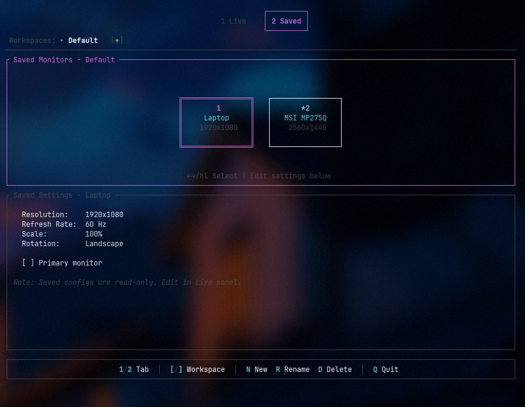

# hyprmon

A terminal user interface (TUI) for managing Hyprland monitor configurations.


## Features

- **Visual Monitor Arrangement** - Drag-and-drop monitors to reorder positions
- **Live Configuration** - Adjust Resolution, Refresh Rate, Scale, Rotation, Primary monitor
- **Workspace Presets** - Save and load multiple monitor configurations
- **Auto-Detection** - Automatically detects monitor connect/disconnect via Hyprland IPC
- **Mouse & Keyboard** - Full support for both input methods
- **Lightweight** - Optimized binary ~775KB

## Screenshots

| Live Tab | Saved Tab |
|----------|-----------|
|  |  |

## Installation

### Arch Linux (AUR)

```bash
paru -S hyprmon
# or
yay -S hyprmon
```

### From Source

Requires Rust 1.70 or later.

```bash
git clone https://github.com/ChauVanLoc01/hyprmon.git
cd hyprmon
cargo build --release
sudo cp target/release/hyprmon /usr/local/bin/
```

## Usage

```bash
hyprmon
```

Or search "Hyprmon" in your app launcher (Walker, Rofi, Wofi, etc.).

### Keyboard Controls

| Key | Action |
|-----|--------|
| `Tab` | Switch between Arrangement/Settings panels |
| `1` / `2` | Switch between Live/Saved tabs |
| `←` `→` | Move monitor position (in Arrangement) |
| `↑` `↓` | Navigate settings / dropdown options |
| `Enter` | Open dropdown / confirm selection |
| `Esc` | Close dropdown / cancel |
| `a` | Apply configuration |
| `y` / `n` | Confirm / Revert changes |
| `i` | Identify monitors (show name on screen) |
| `r` | Refresh monitor list |
| `q` | Quit |

### Mouse Controls

- **Click** on monitor to select
- **Drag** monitors to reorder
- **Click** on settings to edit

### Saved Workspaces (Saved Tab)

| Key | Action |
|-----|--------|
| `[` / `]` | Switch workspace |
| `n` | New workspace |
| `R` | Rename workspace |
| `D` | Delete workspace |

## Configuration

Configuration is stored at:

```
~/.config/hyprmon/monitors.json
```

Generated Hyprland config is written to:

```
~/.config/hypr/monitors.conf
```

Include it in your `hyprland.conf`:

```bash
source = ~/.config/hypr/monitors.conf
```

## Dependencies

- [ratatui](https://github.com/ratatui-org/ratatui) - TUI framework
- [crossterm](https://github.com/crossterm-rs/crossterm) - Terminal handling
- [serde](https://github.com/serde-rs/serde) - Serialization
- [anyhow](https://github.com/dtolnay/anyhow) - Error handling

## Requirements

- Hyprland window manager
- `hyprctl` command available in PATH

## License

MIT

## Author

Chau Van Loc
